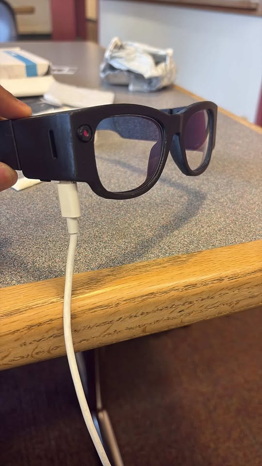

# mechie

mechie is GTC's wearable — a glasses-form-factor device with an on-board camera that streams audio and photos over BLE to a paired phone. The phone app decodes the audio, runs speech-to-text and LLM/AI, and surfaces the assistant in real time.

## Repo layout

- [`omi-mobile/`](omi-mobile) — Expo iOS/Android app that pairs with mechie over BLE, ingests audio/photo streams, and drives STT + AI.
- [`omi-mobile/relay/`](omi-mobile/relay) — small Node WebSocket relay that decodes Opus on a server and pipes PCM to STT (deployable to Fly).
- [`web-stt-test/`](web-stt-test) — earlier browser-based STT prototype the mobile app is ported from.
